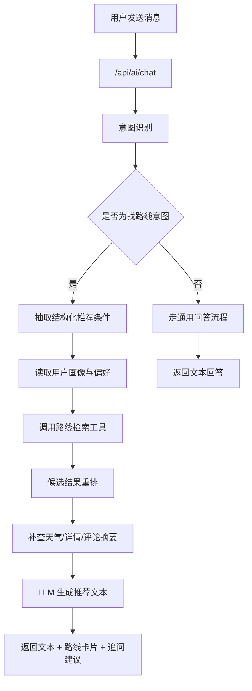
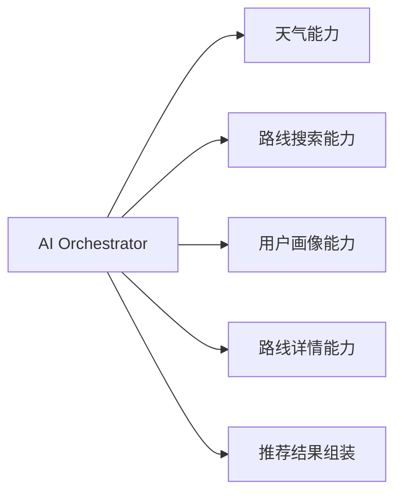

# TrailQuest AI 对话与 AI 推荐路线方案文档

本文档用于定义 TrailQuest 下一阶段 AI 能力的整体落地方案，覆盖两部分：

1. AI 对话
2. AI 推荐路线

目标不是一次性做成复杂智能体平台，而是先把现有聊天页从 mock 升级为可落地、可解释、能真正帮助用户找路线的产品能力。

## 1. 背景与定位

当前项目已经具备以下基础条件：

- 前端聊天页 UI 已完成
- 路线数据已经结构化
- 搜索页已有明确筛选模型
- 用户画像已具备基础数据结构
- 路线详情、天气、评论、轨迹都已经有一定接口基础

这意味着 TrailQuest 当前最适合做的不是“通用聊天机器人”，而是“会用 TrailQuest 现有能力的路线助手”。

## 2. 产品目标

### 2.1 AI 对话目标

AI 对话需要做到：

- 支持基础自然语言问答
- 支持路线、天气、装备、出行建议等相关问题
- 能识别“找路线”的推荐意图
- 能在必要时继续追问用户需求

### 2.2 AI 推荐路线目标

AI 推荐路线需要做到：

- 用户用自然语言表达需求
- AI 返回文本回答 + 结构化路线卡片
- 推荐理由尽量可解释
- 推荐结果可直接点击进入路线详情页

## 3. 当前阶段能力边界

### 3.1 本阶段包含

- 聊天页从 mock 切换到真实接口
- AI 基础对话
- AI 结构化推荐路线
- 会话上下文保留
- 推荐路线卡片展示

### 3.2 本阶段不包含

- 复杂多 Agent 编排
- 自建向量数据库作为主检索
- 私有模型训练
- 独立 AI 后台配置平台
- 长时记忆与跨设备会话同步

## 4. 核心判断

TrailQuest 的 AI 核心价值不在“聊天本身”，而在“帮助用户更高效地做徒步决策”。

因此推荐采用：

- 对话层：LLM 组织语言
- 检索层：结构化路线查询
- 推荐层：画像 + 条件 + 路线特征重排
- 展示层：文本 + 路线卡片

换句话说：

- AI 对话负责理解与表达
- AI 推荐路线负责把 TrailQuest 的路线数据用起来

## 5. 推荐总体方案

### 5.1 统一接口

推荐新增统一接口：

- `POST /api/ai/chat`

该接口统一承接：

- 基础问答
- 找路线
- 装备建议
- 天气建议
- 追问澄清

### 5.2 为什么用一个入口

原因：

- 前端实现简单
- 聊天页天然适合单入口
- 后端更方便统一做工具编排
- 后续可以逐步扩能力，不需要频繁改前端协议

## 6. 主流程设计

### 6.1 总体处理流程



### 6.2 与天气和景观能力关系



当前阶段建议：

- AI 推荐先调用天气能力
- 不强依赖景观预测能力
- 等景观预测稳定后，再把景观结果作为增强输入

## 7. AI 对话能力设计

### 7.1 支持的问题类型

第一阶段建议支持：

- 路线推荐
- 装备建议
- 路线难度解释
- 天气相关建议
- 发布路线相关帮助

### 7.2 不建议当前阶段支持

- 开放式百科问答
- 跨领域泛知识聊天
- 复杂多步任务规划

原因：

- 会分散产品价值
- 难以保证质量
- 与 TrailQuest 主业务关系不强

### 7.3 会话设计建议

接口建议支持：

- `sessionId`
- `messages`
- `context`

目的：

- 支持简短多轮对话
- 允许后续继续追问
- 前端可以在当前会话中保留上下文

## 8. AI 推荐路线能力设计

### 8.1 用户输入示例

用户可能会这样表达：

- 周末想在杭州附近找一条轻松一点的路线
- 想看日出，最好是单日来回
- 想找适合带新手去的轻装路线
- 有没有适合春天拍照的徒步路线

### 8.2 系统需要抽取的条件

建议从自然语言中抽取：

- 地点
- 难度
- 时长
- 装备偏好
- 距离
- 场景偏好
- 出行目的

### 8.3 推荐输出内容

推荐结果至少包含：

- 推荐文本
- 1 到 3 条路线卡片
- 每条路线的推荐理由
- 可继续追问的建议

## 9. 接口结构建议

### 9.1 请求结构建议

```json
{
  "sessionId": "chat-001",
  "message": "周末杭州附近想找一条轻松一点、最好能看日出的路线",
  "context": {
    "userId": "2035",
    "currentTrailId": null
  }
}
```

### 9.2 返回结构建议

```json
{
  "sessionId": "chat-001",
  "answer": "如果你想在周末找一条杭州附近、轻松一些、并且有日出体验的路线，我优先推荐这两条。",
  "intent": "trail_recommendation",
  "trailCards": [
    {
      "id": "1001",
      "name": "老鹰峰顶",
      "location": "浙江 杭州 临安",
      "difficulty": "moderate",
      "difficultyLabel": "适中",
      "distance": "6.4 km",
      "duration": "3h 15m",
      "elevation": "+420 m",
      "rating": 4.9,
      "reviewCount": 1200,
      "image": "/trail-pine.png",
      "reason": "路线时间可控，日出体验强，适合周末短途安排。"
    }
  ],
  "followUps": [
    "你更想看日出还是轻松拍照？",
    "要不要我按单日往返再帮你缩小范围？"
  ],
  "source": {
    "mode": "internal_search"
  }
}
```

## 10. 后端模块建议

### 10.1 推荐新增模块

- `controller/AiController.java`
- `dto/ai/ChatRequest.java`
- `vo/ai/ChatResponse.java`
- `service/AiChatService.java`
- `service/impl/AiChatServiceImpl.java`
- `service/ai/AiIntentParser.java`
- `service/ai/TrailRecommendationService.java`
- `service/ai/AiPromptBuilder.java`

### 10.2 工具层建议

第一阶段建议实现以下工具：

- `getUserPreferenceContext`
- `searchTrails`
- `getTrailDetail`
- `getTrailWeather`
- `summarizeTrailReasons`

不建议第一阶段实现：

- `externalTrailSearch`
- `reviewSemanticRetriever`
- `communityPostRetriever`

这些可以留待下一阶段。

## 11. 前端改造建议

### 11.1 推荐新增内容

- `src/api/ai.ts`
- `src/types/ai.ts`
- `chat store` 改为真实异步请求
- 聊天页支持渲染路线卡片结果

### 11.2 前端展示建议

一条 AI 回复建议由两部分组成：

1. 文本回答
2. 推荐路线卡片区

这样做的好处：

- 用户能快速扫读
- 推荐结果可直接点击
- 不需要把关键信息藏在长文本里

### 11.3 卡片复用建议

优先复用现有：

- `TrailCard.vue`
- 或基于现有卡片做一层 AI 结果适配器

避免为了 AI 再单独做一套完全不同的路线卡片体系。

## 12. 推荐排序建议

第一阶段排序不必过于复杂，但建议至少综合以下因素：

- 用户画像匹配度
- 难度匹配度
- 距离/时长匹配度
- 标签匹配度
- 路线评分
- 收藏与互动热度

如果用户明确提到天气诉求，还应引入：

- 七天天气预报结果

例如：

- “周末去”
- “怕下雨”
- “想看日出”

这类表达都应参与推荐理由生成。

## 13. 错误与降级策略

### 13.1 可能失败的环节

- LLM 调用失败
- 路线检索无结果
- 天气数据不可用
- 意图解析不稳定

### 13.2 建议降级方式

1. 如果 LLM 失败：
   - 返回稳定错误提示
   - 前端展示“AI 暂时不可用”

2. 如果路线检索没有结果：
   - 明确告知“当前库内未找到合适路线”
   - 引导用户换条件继续问

3. 如果天气数据不可用：
   - 继续推荐路线
   - 但不输出天气相关判断

## 14. 验收标准

完成后应满足：

- 聊天页不再依赖 mock 回复
- AI 能处理基础徒步相关问答
- AI 能识别找路线意图
- AI 能返回文本 + 结构化路线卡片
- 推荐结果能直接点击进入详情页
- 多轮追问在短上下文内可用

## 15. 推荐开发顺序

建议按以下顺序实施：

1. 设计 `ChatRequest` 与 `ChatResponse`
2. 搭建 AI 对话接口骨架
3. 打通前端聊天页真实请求
4. 实现基础问答
5. 接入结构化路线搜索
6. 再接天气增强推荐理由

## 16. 一句话总结

TrailQuest 的 AI 第一阶段不应追求“什么都能聊”，而应优先把“会对话、会找路线、会解释推荐理由”这件事做实，让聊天页真正变成路线决策入口，而不是一个漂亮的 mock 页面。
