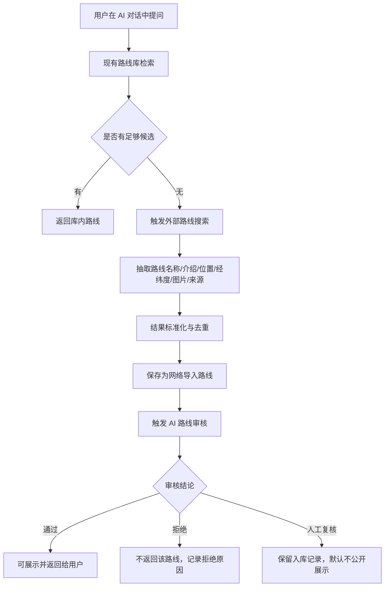
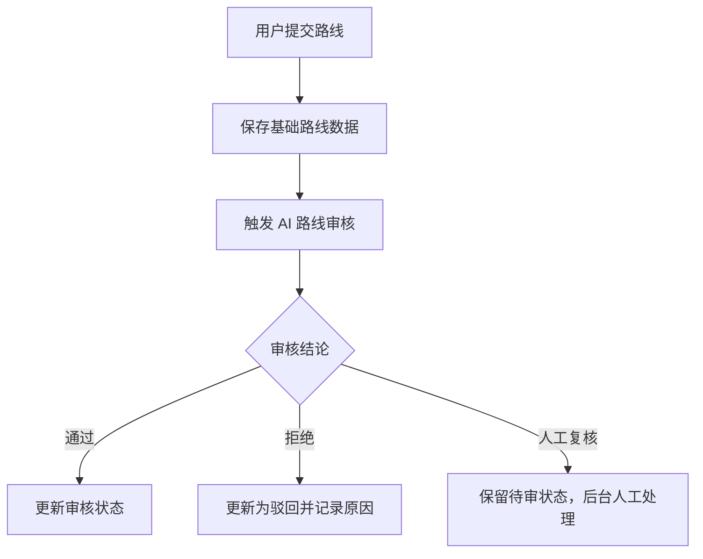

# TrailQuest AI 路线审核与无结果网络搜索导入需求文档

日期：2026-05-20

## 1. 背景

当前 TrailQuest 已具备以下基础能力：

- AI 对话与路线推荐基础链路已经存在，入口见 [AiController.java](/Users/sheng/Documents/code/hiking/apps/api/src/main/java/com/sheng/hikingbackend/controller/AiController.java)
- AI 推荐已支持意图识别、结构化条件提取和路线库检索，核心实现见 [AiRouteRecommendationServiceImpl.java](/Users/sheng/Documents/code/hiking/apps/api/src/main/java/com/sheng/hikingbackend/service/impl/ai/AiRouteRecommendationServiceImpl.java)
- 路线实体已具备名称、介绍、起点经纬度、结构化地理字段、封面图、审核状态等基础字段，表结构见 [hikingDBStruct.sql](/Users/sheng/Documents/code/hiking/DOCS/database/hikingDBStruct.sql:372)
- 后台已具备路线审核通过/驳回能力，核心逻辑见 [AdminServiceImpl.java](/Users/sheng/Documents/code/hiking/apps/api/src/main/java/com/sheng/hikingbackend/service/impl/AdminServiceImpl.java:211)

但当前系统仍存在两个明显缺口：

1. AI 对话找路线时，如果数据库没有相关路线，系统只能返回空结果，无法继续帮助用户。
2. 路线审核仍主要依赖人工判断，缺少一层自动化内容安全预审能力。

因此，本期需要补齐三项联动能力：

1. AI 路线审核
2. AI 对话无结果时的网络搜索导入
3. 网络导入路线在入库前或入库后展示前，先经过 AI 审核

## 2. 目标

本期目标不是做一个复杂通用智能体平台，而是补齐 TrailQuest 路线冷启动与内容治理闭环。

本期目标：

1. 用户在 AI 对话中找不到库内路线时，系统能够自动搜索外部路线信息并返回结果
2. 外部搜索结果能够结构化入库，形成可复用的 Trail 数据
3. 新导入的网络路线必须先经过 AI 审核，再决定是否展示或进入人工复核
4. 用户发布路线也支持 AI 预审，降低后台纯人工审核压力
5. 所有 AI 审核与导入行为都需要留痕，便于后台追踪和回查

## 3. 设计原则

### 3.1 检索优先于生成

LLM 不直接“编造路线”，而是基于外部搜索结果、地图服务结果和已有数据进行抽取、结构化和总结。

### 3.2 审核优先于展示

无论路线来自用户发布还是网络导入，只要进入平台正式数据层，就应经过 AI 审核门禁。

### 3.3 高风险拒绝，不确定转人工

AI 审核不能只做二元“通过/拒绝”。对于高风险内容可以自动拒绝；对于不确定内容应进入人工复核。

### 3.4 外部图片先做来源治理

网络图片存在版权、失效和防盗链风险。本期优先保存图片来源 URL 与来源页，不默认把第三方图片转存到自有 OSS。

### 3.5 轨迹不是本期前置条件

网络导入路线允许没有 GPX/KML 轨迹。本期先保证基础信息、地理点位、简介和图片链路可用。

## 4. 范围定义

### 4.1 本期包含

1. AI 对话命中库内空结果后的外部搜索兜底
2. 外部搜索结果的结构化抽取、去重、地理校验和入库
3. AI 路线审核服务
4. 用户发布路线的 AI 预审
5. 网络导入路线的 AI 预审
6. 审核结果回写、操作留痕和后台可见性

### 4.2 本期不做

1. 通用网页大规模爬虫系统
2. 复杂多 Agent 编排
3. 自动抽取并生成完整轨迹文件
4. 图片版权自动识别
5. 导入路线的自动景观预测补齐
6. 导入路线的自动评论、评分、点赞等社区数据补齐

## 5. 角色与核心场景

### 5.1 普通用户

核心诉求：

- 在 AI 对话中输入“某地徒步路线”时，即使库内没有，也希望拿到可参考的结果
- 返回结果尽量包含路线名称、位置、简介、基础经纬度、配图和来源说明

### 5.2 管理员

核心诉求：

- 减少大量低风险路线的人工逐条审核
- 能看见 AI 审核结论、风险标签、来源站点、导入时间和处理理由
- 对不确定或高风险路线保留人工干预能力

### 5.3 平台

核心诉求：

- 逐步积累冷启动路线库
- 控制黄赌毒、引流广告、违规路线、敏感内容进入前台
- 保证外部导入数据可追溯、可回滚、可治理

## 6. 用户故事

1. 作为普通用户，我在 AI 对话中询问“有没有武功山附近适合新手的路线”时，如果库内没有足够结果，系统应自动搜索外部路线并返回可阅读的路线卡片。
2. 作为普通用户，我希望 AI 返回的外部路线能说明“此结果来自网络收录”，避免误以为是平台原生路线。
3. 作为平台运营，我希望网络导入路线被保存到数据库，以便后续用户再次搜索时优先走库内数据。
4. 作为管理员，我希望网络导入路线先经过 AI 审核，再决定自动通过、自动拒绝或进入人工复核。
5. 作为管理员，我希望用户发布路线也经过 AI 预审，这样明显违规内容可以在后台初筛掉。

## 7. 总体方案

### 7.1 能力拆分

建议拆为三个服务：

1. `ExternalTrailSearchService`
   负责网络搜索、候选抓取、结构化抽取和基础去重
2. `AiTrailModerationService`
   负责路线文本与图片的 AI 审核
3. `ImportedTrailIngestionService`
   负责把外部结果标准化后入库，并触发 AI 审核与状态回写

### 7.2 总流程



### 7.3 用户发布路线流程



## 8. 业务流程要求

### 8.1 AI 对话无结果时的网络搜索触发条件

触发条件建议：

1. 当前 AI 推荐链路库内候选结果为空
2. 或候选结果低于最小阈值，例如少于 `2` 条
3. 且用户意图明确属于“找路线”而不是泛问答

不触发场景：

1. 用户是纯装备问答、天气问答、路线难度解释
2. 用户输入过于模糊，无法提取有效地点
3. 用户明确要求“只看平台已有路线”

### 8.2 网络搜索结果的最小结构化要求

一条可入库的外部路线，至少应满足：

- 路线名称
- 位置描述
- 一段可读介绍
- 至少一个地理点位
  点位可为起点经纬度、景区中心点或路线区域中心点
- 至少一张可展示图片或封面候选
- 至少一个来源页 URL

若缺失名称、位置或地理点位，则不入库，只作为临时搜索结果放弃。

### 8.3 网络导入路线返回规则

建议规则：

1. 仅返回通过 AI 审核的导入路线
2. 被 AI 拒绝的路线不返回给用户
3. 进入人工复核的路线默认不返回给用户，但保留入库记录供后台查看
4. 返回时应标记来源，例如“网络收录”或“外部资料整理”

### 8.4 网络导入结果的幂等规则

同一条路线重复搜索时，不应无限新增重复数据。

建议去重优先级：

1. `source_url` 完全一致
2. `name + geo_city + start_lng + start_lat` 高相似
3. `name + location` 高相似

若命中重复：

- 更新已有导入记录的抓取时间、来源补充信息和审核重试状态
- 不新建第二条主路线记录

## 9. AI 路线审核需求

### 9.1 审核对象

AI 路线审核覆盖两类来源：

1. 用户发布路线
2. 网络导入路线

审核输入可包括：

- 路线名称
- 位置描述
- 路线介绍
- 标签
- 图片 URL 或图片内容摘要
- 来源站点名称
- 来源页标题

### 9.2 审核目标

AI 审核至少要识别以下风险：

1. 黄赌毒相关内容
2. 暴力、血腥、自残或违法活动引导
3. 明显广告引流、联系方式导流、社群拉新
4. 敏感政治或平台禁止内容
5. 与徒步路线无关的垃圾内容
6. 明显虚构、无法落地的路线信息

### 9.3 审核结论

审核结论建议为三态：

- `approved`：低风险，可通过
- `rejected`：高风险，直接拒绝
- `needs_manual_review`：不确定，需要人工复核

### 9.4 审核输出字段

AI 审核结果至少包含：

- `decision`
- `risk_level`
- `risk_categories`
- `reason`
- `model_name`
- `reviewed_at`
- `trace_id`

示例：

```json
{
  "decision": "needs_manual_review",
  "riskLevel": "medium",
  "riskCategories": ["ambiguous_location", "ad_like_text"],
  "reason": "路线文本包含外部联系方式描述，且地理信息可信度不足",
  "modelName": "qwen-plus",
  "reviewedAt": "2026-05-20T14:25:00+08:00",
  "traceId": "ai-review-2039001"
}
```

### 9.5 审核策略

建议策略：

1. 纯低风险内容：自动通过
2. 明确高风险内容：自动拒绝
3. 信息不完整、来源异常、语义模糊、模型置信度不足：转人工复核

### 9.6 审核失败兜底

当 AI 接口超时、异常或模型不可用时：

1. 不允许默认自动通过
2. 应回写 `needs_manual_review`
3. 保留失败原因和重试次数

## 10. 网络搜索与导入需求

### 10.1 外部数据源要求

本期建议优先接入两类来源：

1. 地图/POI 类服务
   用于补齐地点、经纬度、名称校验
2. 白名单网页来源
   用于抽取路线介绍、图片、路线基础信息

本期不建议直接对任意全网页面无限制抓取。

### 10.2 LLM 在网络导入中的职责

LLM 的职责应限定为：

1. 从候选网页或搜索结果中抽取结构化字段
2. 总结路线介绍
3. 判断候选是否像真实徒步路线
4. 输出标准化 JSON

LLM 不负责：

1. 直接生成不存在的路线
2. 捏造经纬度
3. 捏造图片地址

### 10.3 字段映射建议

网络导入路线至少要映射到现有 `trails` 字段：

- `name`
- `location`
- `start_lng`
- `start_lat`
- `description`
- `image`
- `review_status`

如能提取，可补充：

- `geo_country`
- `geo_province`
- `geo_city`
- `geo_district`
- `difficulty`
- `difficulty_label`
- `distance`
- `duration`
- `elevation`

无法可靠提取的字段，允许使用兜底默认值，但必须标记来源置信度，避免伪精确。

### 10.4 图片处理要求

图片处理建议：

1. 本期优先保存来源图片 URL，不强制转存 OSS
2. 返回前端时应允许显示外部图片，但要接受失效风险
3. 后台详情中需展示图片来源页，便于人工校验
4. 后续若要转存 OSS，需要补版权合规评估

## 11. 状态流转设计

### 11.1 推荐新增来源类型

建议为路线补充来源字段：

- `source_type = user_upload | ai_web_import`
- `source_site`
- `source_url`
- `source_confidence`
- `import_batch_no`

### 11.2 推荐新增 AI 审核字段

建议新增：

- `ai_review_status = pending | approved | rejected | needs_manual_review | failed`
- `ai_review_reason`
- `ai_review_risk_level`
- `ai_review_categories_json`
- `ai_review_model`
- `ai_reviewed_at`
- `ai_review_trace_id`

### 11.3 与现有人工审核字段关系

当前 `trails` 已有：

- `review_status`
- `review_remark`
- `reviewed_by`
- `reviewed_at`

建议不要直接用 `review_status` 代替 `ai_review_status`，而应分层：

1. `ai_review_status` 表示机器审核结论
2. `review_status` 表示平台最终业务审核状态

这样可以避免后续人工审核、AI 审核、运营复核混在一个字段里。

### 11.4 建议流转规则

#### 用户发布路线

1. 提交后先写入 `ai_review_status = pending`
2. AI 处理完成后：
   - 低风险：`ai_review_status = approved`，`review_status = pending` 或按配置自动通过
   - 高风险：`ai_review_status = rejected`，`review_status = rejected`
   - 不确定：`ai_review_status = needs_manual_review`，`review_status = pending`

#### 网络导入路线

1. 导入后先写入 `source_type = ai_web_import`
2. 同步或异步触发 AI 审核
3. 审核通过后才允许进入前台可见集合
4. 审核拒绝则保留后台记录但不前台展示
5. 人工复核则进入后台待处理列表

## 12. 数据库设计建议

### 12.1 `trails` 表增量字段建议

建议增加：

```sql
ALTER TABLE trails
    ADD COLUMN source_type VARCHAR(32) NOT NULL DEFAULT 'user_upload' COMMENT '来源类型' AFTER author_id,
    ADD COLUMN source_site VARCHAR(128) NULL COMMENT '来源站点' AFTER source_type,
    ADD COLUMN source_url VARCHAR(500) NULL COMMENT '来源链接' AFTER source_site,
    ADD COLUMN source_confidence DECIMAL(4,3) NULL COMMENT '导入置信度' AFTER source_url,
    ADD COLUMN import_batch_no VARCHAR(64) NULL COMMENT '导入批次号' AFTER source_confidence,
    ADD COLUMN ai_review_status VARCHAR(32) NOT NULL DEFAULT 'pending' COMMENT 'AI审核状态' AFTER review_status,
    ADD COLUMN ai_review_reason VARCHAR(500) NULL COMMENT 'AI审核原因' AFTER ai_review_status,
    ADD COLUMN ai_review_risk_level VARCHAR(32) NULL COMMENT 'AI风险等级' AFTER ai_review_reason,
    ADD COLUMN ai_review_categories_json JSON NULL COMMENT 'AI风险分类' AFTER ai_review_risk_level,
    ADD COLUMN ai_review_model VARCHAR(64) NULL COMMENT 'AI审核模型' AFTER ai_review_categories_json,
    ADD COLUMN ai_reviewed_at DATETIME NULL COMMENT 'AI审核时间' AFTER ai_review_model,
    ADD COLUMN ai_review_trace_id VARCHAR(128) NULL COMMENT 'AI审核追踪ID' AFTER ai_reviewed_at;
```

### 12.2 推荐新增导入日志表

建议新增 `trail_import_jobs` 或 `trail_import_records`，用于记录：

- 搜索关键词
- 原始来源列表
- 抽取原始 JSON
- 导入结果
- 去重命中情况
- 审核结果
- 错误原因
- 重试次数

这样可以避免所有导入细节都挤进 `trails` 主表。

## 13. 接口需求建议

### 13.1 AI 对话接口

当前已存在：

- `POST /api/ai/chat/stream`

建议在现有 AI 对话编排中新增：

1. 库内空结果判断
2. 外部搜索服务调用
3. 导入结果的来源标记

返回结构建议新增字段：

- `source = internal | external_mixed`
- `isImported = true | false`
- `sourceSite`
- `sourceUrl`

### 13.2 后台审核接口

建议后台补充查看能力：

1. 查看 AI 审核状态
2. 查看 AI 审核原因
3. 查看导入来源
4. 查看导入原始摘要
5. 人工重新审核
6. 重新触发 AI 审核

### 13.3 内部服务接口

建议内部抽象以下服务方法：

1. `searchExternalTrails(query)`
2. `normalizeExternalTrail(rawItem)`
3. `ingestExternalTrail(item)`
4. `moderateTrail(payload)`
5. `retryTrailModeration(trailId)`

## 14. 后台需求

后台路线审核列表需要新增以下筛选维度：

1. 来源类型
2. AI 审核状态
3. AI 风险等级
4. 来源站点
5. 是否网络导入

后台路线审核详情需要新增以下信息区块：

1. AI 审核结论
2. 风险分类
3. AI 审核原因
4. 来源页链接
5. 原始导入摘要
6. 图片来源信息

## 15. 非功能需求

### 15.1 性能

1. 库内命中时，不应强制走外部搜索
2. 外部搜索应有超时控制，建议单次不超过 `5~8` 秒
3. 外部搜索与导入建议异步化，避免长时间阻塞聊天主链路

### 15.2 安全

1. 不抓取用户私有页面
2. 不执行不可信网页脚本
3. 对外部 URL 做白名单和协议校验
4. 对 AI 审核结果保留 trace，便于审计

### 15.3 可维护性

1. 搜索、导入、审核三个服务边界清晰
2. 导入规则和审核规则可独立演进
3. 外部数据源可配置，不写死在业务逻辑中

## 16. 验收标准

### 16.1 AI 路线审核

1. 用户发布路线后能自动触发 AI 审核
2. 审核结果能区分通过、拒绝、人工复核
3. 后台能看到 AI 审核状态和原因
4. AI 审核失败时不会默认放行

### 16.2 无结果网络搜索导入

1. AI 对话在库内无结果时会触发外部搜索
2. 返回结果至少包含名称、简介、位置、经纬度或区域点位、图片和来源
3. 搜索结果会入库，不会每次都重复新建路线
4. 重复搜索同一路线时会命中去重规则

### 16.3 导入路线先经过 AI 审核

1. 网络导入路线入库后必须触发 AI 审核
2. AI 拒绝的路线不会出现在前台
3. 需要人工复核的路线不会自动公开
4. 审核通过的路线可以在当前对话中返回，并供后续检索复用

## 17. 分期建议

### 17.1 第一阶段

1. 用户发布路线 AI 预审
2. 外部搜索兜底原型
3. 网络导入基础入库
4. AI 审核结果回写

### 17.2 第二阶段

1. 后台导入记录工作台
2. 重试与批量复核
3. 更细致的来源治理和图片策略
4. 导入路线与地图服务、天气服务进一步联动

## 18. 风险与注意事项

1. 外部图片存在版权和失效风险，本期只能先做“来源保存 + 可展示”
2. LLM 结构化抽取可能出现幻觉，经纬度和地点必须尽量用地图服务二次校验
3. AI 审核存在误判风险，因此必须保留人工复核口
4. 网络导入路线可能质量参差不齐，不建议一上来就全部自动公开
5. 若未来路线量增大，应补充更严格的去重、来源评分和抓取治理策略

## 19. 结论

本需求的核心不是“让 AI 更会聊天”，而是让 TrailQuest 在路线供给不足时具备外部补数能力，并在补数与内容生产过程中加入自动化审核门禁。

推荐的最小闭环是：

1. 用户提问
2. 库内检索
3. 无结果则外部搜索
4. 结构化导入
5. AI 审核
6. 通过后返回与复用
7. 不确定则留给后台复核

这样既能解决路线冷启动问题，也能保持平台内容治理边界清晰。
