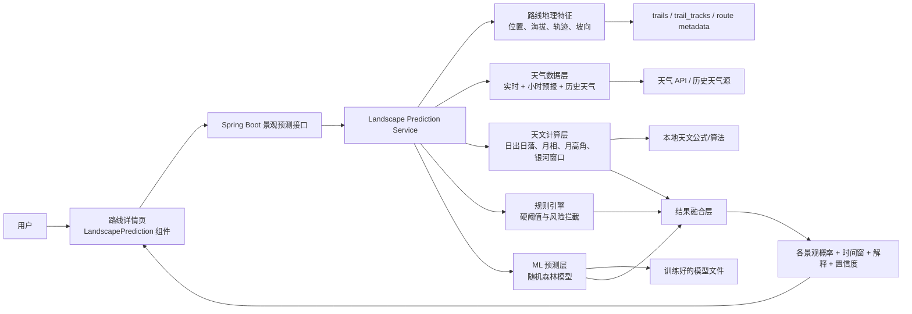
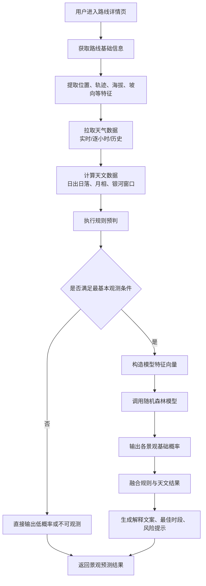
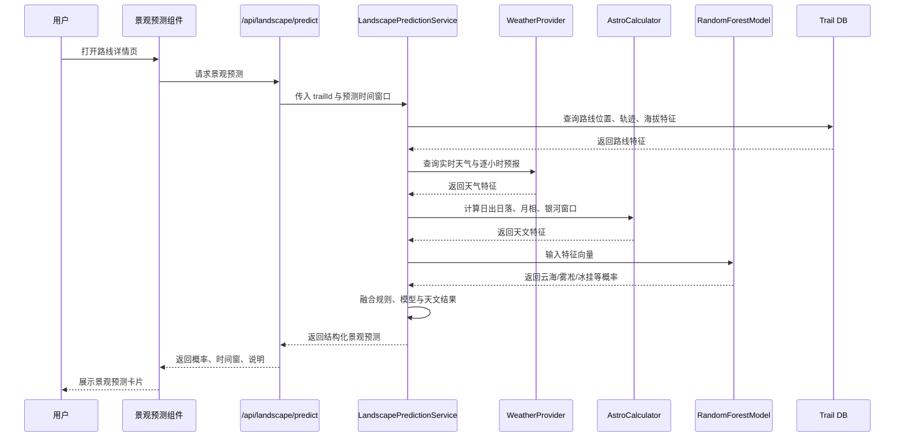

# TrailQuest 景观预测系统开发文档

本文档用于定义 TrailQuest 路线区域景观预测能力的第一版落地方案，覆盖以下 5 类景观能力：

- 云海预测
- 雾凇预测
- 日出日落预测
- 肉眼见银河预测
- 冰挂预测

本文档的核心结论是：

- 仅靠当前天气查询结果，不足以支撑可靠预测
- 仅用随机森林，也不足以覆盖全部景观类型
- 最合理的工程方案是：`规则引擎 + 天文计算 + 随机森林概率模型` 的混合系统

## 1. 目标与结论

### 1.1 目标

在路线详情页的“景观预测”模块中，为用户提供每条路线在未来时间窗口内的景观出现概率、最佳观赏时段、影响因子和风险提示。

### 1.2 为什么不能只靠当前天气接口

当前项目天气能力主要来自实时天气查询，字段包括：

- 天气现象
- 温度
- 湿度
- 风向
- 风力
- 报告时间

这组数据可以支持基础提示，但不足以支撑可靠景观预测，原因如下：

- 没有逐小时天气预报
- 没有云量、低云量、高云量
- 没有能见度
- 没有露点温度
- 没有降水概率与降水量
- 没有气压与气压变化趋势
- 没有历史样本标签
- 没有月相、月落、月出、银河季节窗口
- 没有光污染等级

因此，直接拿当前天气结果训练随机森林，效果会非常不稳定。

### 1.3 可行结论

可行，但前提是补充更多数据，并且按景观类型拆分策略：

- `日出日落预测`：优先使用确定性天文计算，不需要随机森林
- `肉眼见银河预测`：优先使用天文计算 + 天气条件 + 光污染规则，再用随机森林校准概率
- `云海预测 / 雾凇预测 / 冰挂预测`：适合使用随机森林或 GBDT 等非线性分类模型

换句话说，真正合适的方案不是“一个随机森林预测全部”，而是“每类景观一套特征逻辑，统一输出到前端”。

## 2. 适用性分析

### 2.1 分景观判断

#### 云海预测

适合做概率模型，推荐随机森林。

关键依赖：

- 高湿度
- 夜间到清晨温差
- 风速较低或中低
- 层状云和低云覆盖情况
- 地形抬升与海拔
- 前一日降水

#### 雾凇预测

适合做概率模型，推荐随机森林或规则与模型结合。

关键依赖：

- 气温接近或低于 `0°C`
- 高湿度
- 风速适中
- 云雾环境
- 山脊、迎风坡、高海拔

#### 日出日落预测

不建议依赖随机森林主预测。

更适合：

- 用天文公式计算精确时间
- 用天气与云量计算“可见度”

也就是说：

- `日出时间 / 日落时间` 是确定值
- `日出可见度 / 日落可见度` 才是概率预测

#### 肉眼见银河预测

不建议单独依赖随机森林。

关键依赖：

- 太阳高度角
- 月相与月亮亮度
- 月出月落时间
- 云量
- 能见度
- 空气湿度
- 光污染等级
- 海拔

因此更适合：

- 先用天文规则过滤“是否具备观测窗口”
- 再用模型输出“可见概率”

#### 冰挂预测

可以做概率模型，但必须补全更多温湿和冻融条件数据。

关键依赖：

- 气温持续低于 `0°C`
- 前期有融水或降水
- 阴面崖壁、瀑布、岩壁、峡谷地形
- 风速与湿度
- 日照不足区域

## 3. 推荐总体方案

### 3.1 方案概述

推荐建立一个统一景观预测服务：

- `POST /api/landscape/predict`
- 或在路线详情接口中内嵌 `landscapePrediction`

该服务内部按景观类型分流：

- 天文型：日出、日落、银河
- 气象地形型：云海、雾凇、冰挂

### 3.2 架构图



### 3.3 流程图



### 3.4 时序图



## 4. 当前项目可复用能力

当前仓库已具备以下可复用基础：

- 路线详情页已有 `LandscapePrediction.vue` 组件占位
- 已有 `useTrailWeather.ts`，可拿到实时天气基础信息
- 已有 `useTrailGeo.ts`，可拿到地理编码和城市编码
- 已有 `trail_tracks` 结构化轨迹数据
- 已有路线基础信息：地点、轨迹、海拔爬升、时长、标签

但当前仍然缺少：

- 逐小时天气预报
- 历史天气样本
- 光污染数据
- 天文计算模块
- 模型训练数据集

## 5. 数据需求

### 5.1 最低必需数据

为了让预测不止是“看起来像预测”，建议至少补全以下字段：

- `forecast_time`
- `temperature`
- `humidity`
- `wind_speed`
- `wind_direction`
- `cloud_cover_total`
- `cloud_cover_low`
- `visibility`
- `precipitation_probability`
- `precipitation_amount`
- `pressure`
- `dew_point`

### 5.2 地理与路线特征

建议从路线本身抽取或补录：

- `lat`
- `lng`
- `elevation_peak`
- `elevation_gain`
- `slope_mean`
- `aspect_main`
- `ridge_exposure`
- `waterfall_nearby`
- `valley_nearby`
- `camping_possible`
- `light_pollution_level`

### 5.3 历史标签数据

随机森林模型最终依赖监督学习，因此还需要标签：

- 某天某路线是否出现云海
- 某天某路线是否出现雾凇
- 某天某路线是否适合看银河
- 某天某路线是否形成冰挂
- 某天某路线日出/日落是否可见

标签来源可以分阶段：

1. 人工运营补录
2. 用户照片与游记打标签
3. 评论文本抽取弱标签
4. 后期结合图像识别做自动校正

## 6. 算法设计

### 6.1 推荐算法框架

推荐采用混合架构：

- 规则引擎：负责硬条件拦截
- 天文计算：负责日出日落、银河窗口
- 随机森林：负责复杂非线性气象景观概率估计

### 6.2 为什么随机森林适合

随机森林适合当前阶段的原因：

- 能处理非线性关系
- 对特征尺度不敏感
- 对缺失值和噪声容忍度较高
- 训练和推理成本相对可控
- 输出特征重要性，方便解释

### 6.3 随机森林公式

对于一个输入特征向量 `x`，随机森林分类器可表示为：

```text
F(x) = majority_vote(T1(x), T2(x), ..., TB(x))
```

其中：

- `B` 表示决策树数量
- `Ti(x)` 表示第 `i` 棵树对样本 `x` 的分类结果

若输出概率，则可写为：

```text
P(y = 1 | x) = (1 / B) * Σ p_i(y = 1 | x)
```

其中：

- `p_i(y = 1 | x)` 表示第 `i` 棵树对正类的概率输出

在 TrailQuest 中，可以把 `y = 1` 理解为：

- `云海出现`
- `雾凇出现`
- `冰挂出现`

### 6.4 单棵树的划分依据

单棵决策树训练时，可以使用基尼不纯度：

```text
Gini(D) = 1 - Σ p_k^2
```

其中：

- `p_k` 表示样本集 `D` 中第 `k` 类的占比

树会选择让划分后加权不纯度最小的特征：

```text
Gini_split(D, A) = (|D1| / |D|) * Gini(D1) + (|D2| / |D|) * Gini(D2)
```

这里：

- `A` 是候选划分特征
- `D1` 和 `D2` 是划分后的两个子集

### 6.5 一个简化实例

以云海预测为例，输入特征向量可以表示为：

```text
x = [humidity, temp_diff_night_morning, wind_speed, low_cloud_cover, elevation_peak, rain_24h]
```

假设随机森林由 `100` 棵树组成，其中：

- `72` 棵树判断“有云海”
- `28` 棵树判断“无云海”

则基础概率可近似写为：

```text
P(cloud_sea = 1 | x) ≈ 72 / 100 = 0.72
```

如果规则引擎又发现：

- 当前低云量很高但风速合适
- 夜间湿度大于 `92%`
- 清晨地面温度接近露点

则融合层可以把结果修正为：

- 云海概率 `78%`
- 最佳时间 `06:00 - 08:00`

## 7. 各景观推荐特征

### 7.1 云海预测特征

- 夜间湿度
- 清晨湿度
- 夜间最低温
- 清晨温度
- 露点差
- 风速
- 低云量
- 前 24 小时降水
- 海拔
- 山谷/盆地地形标记

### 7.2 雾凇预测特征

- 温度是否低于 `0°C`
- 湿度是否高于 `85%`
- 风速是否在适中区间
- 云雾覆盖
- 海拔
- 山脊迎风面

### 7.3 日出日落预测特征

时间计算依赖：

- 纬度
- 经度
- 日期
- 时区

可见度判断依赖：

- 日出前后云量
- 能见度
- 风速
- 降水

### 7.4 银河预测特征

- 太阳高度角
- 月相
- 月亮照明比例
- 月出月落时间
- 银河季节窗口
- 云量
- 能见度
- 湿度
- 光污染
- 海拔

### 7.5 冰挂预测特征

- 持续低温时长
- 近 24 到 72 小时降水
- 湿度
- 风速
- 阴面坡标记
- 瀑布/岩壁/峡谷邻近程度
- 日照时长

## 8. 推荐工程实现

### 8.1 服务拆分

建议新增：

- `LandscapePredictionController`
- `LandscapePredictionService`
- `LandscapeFeatureAssembler`
- `AstronomyCalculator`
- `LandscapeRuleEngine`
- `RandomForestInferenceService`

### 8.2 接口建议

建议新增：

- `GET /api/trails/{id}/landscape-prediction`

响应结构建议：

```json
{
  "generatedAt": "2026-03-22T10:30:00+08:00",
  "dataSource": {
    "weather": "forecast_provider_v1",
    "astronomy": "local_calc_v1",
    "modelVersion": "rf-cloud-v1"
  },
  "predictions": [
    {
      "type": "cloud_sea",
      "label": "云海概率",
      "probability": 0.78,
      "score": 78,
      "bestWindow": "06:00 - 08:00",
      "level": "high",
      "explanation": "夜间湿度高、清晨低风、低云条件较好，适合观察云海。"
    },
    {
      "type": "sunrise_visibility",
      "label": "日出可见度",
      "probability": 0.92,
      "score": 92,
      "bestWindow": "06:15",
      "level": "excellent",
      "explanation": "日出时段云量较低，能见度较好。"
    }
  ]
}
```

### 8.3 前端展示建议

当前你给出的 UI 方向是可行的，建议前端按统一卡片列表渲染：

- 左侧显示景观名称
- 右侧显示百分比
- 中间显示进度条
- 底部显示最佳时间/说明

另外建议为每个景观增加：

- `explanation`
- `confidence`
- `dataQuality`

这样用户会更信任这个预测系统。

## 9. 第一阶段实施建议

### 9.1 第一阶段先做可落地 MVP

推荐优先级：

1. 日出日落时间计算
2. 日出日落可见度
3. 云海概率
4. 银河可见度
5. 雾凇与冰挂

原因：

- 日出日落最容易做出稳定结果
- 云海是山地场景里最容易形成用户感知价值的功能
- 银河其次，但需要补光污染与月相数据
- 雾凇和冰挂对数据要求更高，可以第二波做

### 9.2 第一阶段可接受的技术路线

MVP 阶段建议：

- 先接逐小时天气预报
- 先实现本地天文计算
- 云海先用规则模型起步
- 日出/日落直接走公式 + 云量可见度
- 银河先用规则评分，不急着上模型

然后第二阶段再引入随机森林。

### 9.3 为什么不建议一上来就训模型

因为目前最缺的不是算法，而是数据：

- 没有稳定标签
- 没有逐小时特征
- 没有历史回溯
- 没有路线级静态地理特征库

如果数据不完整，随机森林只会学到噪声。

## 10. 最终推荐路线

最推荐的落地顺序是：

1. 补充天气和天文数据层
2. 建立路线级静态特征库
3. 用规则与公式先跑通第一版景观预测
4. 沉淀历史标签与用户反馈
5. 再引入随机森林做概率校准和排序优化

## 11. 结论

结合 TrailQuest 当前项目状态，景观预测功能是完全值得做的，但不建议简单理解为“查天气 + 上随机森林”。

更准确的判断是：

- `日出日落` 主要靠天文计算
- `银河` 主要靠天文计算 + 天气 + 光污染规则
- `云海 / 雾凇 / 冰挂` 适合在补齐数据后使用随机森林预测

因此最佳方案是：

- 第一版先做混合系统
- 先让结果可信、可解释、可上线
- 再逐步把随机森林纳入正式预测链路
