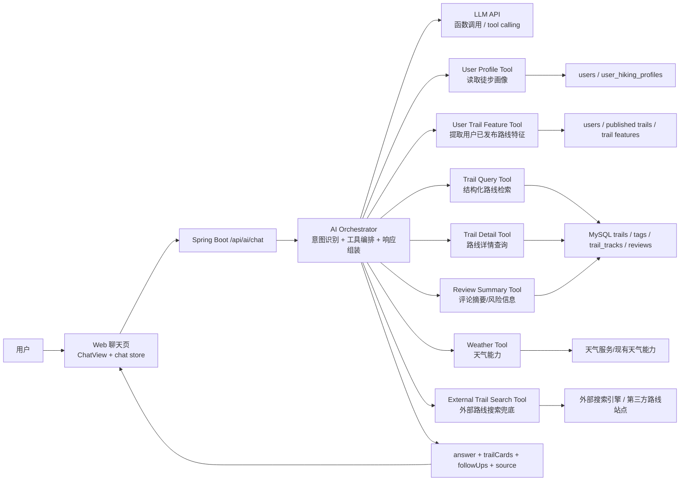
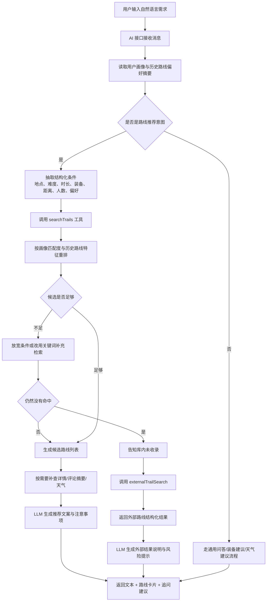
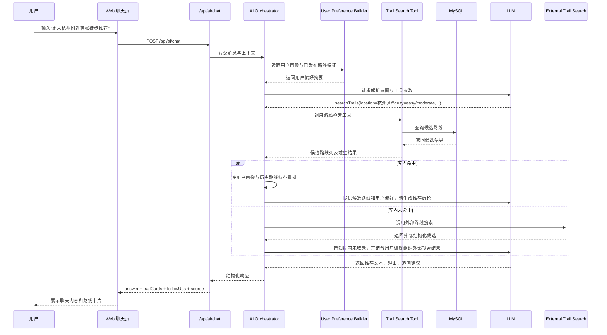

# TrailQuest 轻量 AI 检索层开发文档

本文档用于定义 TrailQuest 第一版 AI 对话找路线能力的落地方案。目标不是一次性引入重型 Agent、复杂 RAG 或独立 Python 编排服务，而是基于现有 `Vue + Spring Boot + trails 数据接口`，先搭建一层可上线、可演进、可解释的轻量 AI 检索层。

## 1. 背景与目标

### 1.1 当前项目现状

当前仓库已经具备以下基础能力：

- 路线列表查询、详情查询、点赞、收藏、发布
- 结构化路线数据：难度、距离、时长、装备类型、标签、作者、轨迹
- 轨迹文件解析与结构化存储
- 搜索页已有筛选参数模型
- 聊天页 UI 已完成，但回复逻辑仍是 mock

这意味着 TrailQuest 现在最缺的不是“训练模型”，而是“让模型会用现有路线系统”。

### 1.2 第一阶段目标

第一阶段 AI 检索层需要做到：

- 用户可以用自然语言描述出行需求
- AI 能调用现有路线检索能力筛出候选路线
- AI 在推荐时结合用户画像与用户历史路线特征
- AI 能结合路线详情生成推荐理由
- AI 返回结构化推荐结果，前端可直接渲染路线卡片
- 系统具备后续接入评论摘要、天气、用户偏好、RAG 的扩展空间
- 当库内没有命中路线时，能明确告知“当前数据库未收录”，并尝试触发外部路线搜索兜底

### 1.3 第一阶段不做

为了控制复杂度，第一阶段明确不做：

- 不训练私有模型
- 不引入复杂多 Agent 编排
- 不把所有路线数据先做成向量库主检索
- 不单独引入 Python LangChain 服务作为主链路

## 2. 核心判断

TrailQuest 的“找路线”本质上是一个结构化检索问题，而不是纯文本问答问题。

同时，它也是一个带有“个性化排序”特征的推荐问题，而不是单纯的关键词匹配问题。

适合结构化检索的字段包括：

- `difficulty`
- `packType`
- `durationType`
- `distance`
- `rating`
- `reviewCount`
- `likes / favorites`
- `location`
- `tags`
- `track.distanceMeters / elevationGainMeters / durationSeconds`

因此第一版推荐方案是：

- 主检索：结构化查询 + 关键词补充
- 个性化：用户画像 + 用户历史发布路线特征参与排序
- 主生成：LLM 根据检索结果组织回答
- 主控制：由后端 AI 服务统一编排工具调用

后续如果评论、社区帖子、攻略文章越来越多，再对文本内容补充 RAG 与向量检索。

## 3. 总体方案

### 3.1 方案概述

新增一个统一 AI 接口：

- `POST /api/ai/chat`

该接口内部完成：

1. 解析用户意图
2. 读取用户画像与用户历史路线偏好摘要
3. 提取检索条件
4. 调用路线工具查询候选路线
5. 对候选路线做个性化重排
6. 必要时补查路线详情、评论摘要、天气
7. 将候选结果交给 LLM 组织自然语言回答
8. 返回文本答案与结构化推荐路线
9. 库内未命中时触发外部搜索兜底

### 3.2 架构图



### 3.3 处理流程图



### 3.4 时序图



## 4. 模块设计

### 4.1 Web 前端

职责：

- 发送用户消息到 `/api/ai/chat`
- 展示文本回答
- 展示结构化推荐路线卡片
- 支持“继续追问”与“查看路线详情”

建议新增内容：

- `src/api/ai.ts`
- `src/types/ai.ts`
- `chat store` 从 mock 回复切换为真实异步请求
- 聊天气泡下方增加推荐路线列表区块
- 推荐路线卡片直接复用现有 `TrailCard.vue`
- 增加 `AI -> TrailCard` 适配器，将后端返回结构适配为现有卡片入参
- 在 chat store 请求时自动带上当前用户 ID 对应的推荐上下文

### 4.2 AI Controller

职责：

- 对外暴露 `POST /api/ai/chat`
- 接收当前用户 ID、消息文本、上下文会话 ID
- 返回结构化 AI 响应

建议新增：

- `controller/AiController.java`
- `dto/ai/ChatRequest.java`
- `vo/ai/ChatResponse.java`

### 4.3 AI Orchestrator

职责：

- 管理 prompt
- 调用 LLM
- 执行工具路由
- 合并工具结果
- 控制兜底策略
- 注入用户画像与用户历史路线偏好

建议新增：

- `service/AiChatService.java`
- `service/impl/AiChatServiceImpl.java`

这是第一阶段的核心模块。

### 4.4 Tool 层

第一阶段建议实现以下工具：

- `getUserPreferenceContext`
- `searchTrails`
- `getTrailDetail`
- `getTrailReviewSummary`
- `getWeatherSummary`
- `externalTrailSearch`

说明：

- `getUserPreferenceContext` 负责把显式画像和隐式路线偏好汇总成推荐上下文
- `searchTrails` 是主工具，复用现有路线分页筛选逻辑
- `getTrailDetail` 用于拿更完整的推荐依据
- `getTrailReviewSummary` 第一版可先简单聚合高频优点/风险
- `getWeatherSummary` 可先做占位，后续再接外部天气
- `externalTrailSearch` 仅在库内未命中时触发，避免把外部搜索变成主链路

### 4.5 用户偏好建模

推荐上下文不应只来自用户当前一句话，还应来自两部分：

- 显式画像：用户自己填写的徒步画像
- 隐式画像：用户已发布路线所体现出的真实偏好

当前仓库已有显式画像字段：

- `experienceLevel`
- `trailStyle`
- `packPreference`

推荐新增“隐式偏好摘要”：

- 最近发布路线的平均难度
- 最近发布路线的平均距离
- 最近发布路线的平均爬升
- 单日 / 多日偏好分布
- 轻装 / 重装偏好分布
- 常见标签偏好，例如 `日出 / 云海 / 露营 / 湖泊`
- 常见地形或场景偏好，例如 `山顶 / 森林 / 峡谷`

这样系统就能区分：

- 用户“说自己是新手”，但实际长期发布高难路线
- 用户“画像偏轻装”，但最近明显偏向多日重装

第一阶段建议做“显式画像优先，隐式偏好纠偏”。

## 5. 接口设计

### 5.1 请求

`POST /api/ai/chat`

请求体建议：

```json
{
  "sessionId": "optional-session-id",
  "message": "周末想在杭州附近找一条轻松一点、适合带朋友去的路线",
  "context": {
    "currentTrailId": null,
    "currentCity": "杭州",
    "useUserPreference": true
  }
}
```

### 5.2 响应

```json
{
  "answer": "如果你想周末带朋友轻松走一条观景路线，我更推荐这 3 条：...",
  "intent": "trail_recommendation",
  "source": "internal",
  "trailCards": [
    {
      "id": "193847562901",
      "image": "https://cdn.example.com/trails/eagle-peak.jpg",
      "name": "老鹰峰顶",
      "description": "距离杭州近，时长适中，风景观赏性强，适合周末半日徒步。",
      "difficulty": "moderate",
      "difficultyLabel": "适中",
      "packType": "light",
      "durationType": "single_day",
      "rating": 4.9,
      "reviews": "(1.2k 条评论)",
      "distance": "6.4 km",
      "elevation": "+420 m",
      "duration": "3h 15m",
      "likes": 1256,
      "favorites": 3842,
      "likedByCurrentUser": false,
      "favoritedByCurrentUser": false,
      "reason": "距离杭州近，朋友一起出行负担不大，观景反馈稳定。 "
    }
  ],
  "followUps": [
    "要不要我再按新手友好程度帮你缩小范围？",
    "如果你们打算日出出发，我也可以帮你改成日出路线推荐。"
  ]
}
```

### 5.3 推荐的数据结构

建议前端响应不要只返回纯文本，而是至少包含：

- `answer`
- `intent`
- `trailCards`
- `followUps`
- `source`
- `appliedPreferenceSummary`
- `debug.toolCalls`（开发环境可选）

这样前端才能把 AI 从“聊天框”升级成“路线顾问”。

### 5.4 用户偏好上下文结构

建议后端内部维护一个统一的用户偏好上下文对象：

```json
{
  "explicitProfile": {
    "experienceLevel": "intermediate",
    "trailStyle": "city_weekend",
    "packPreference": "light"
  },
  "implicitPreference": {
    "avgDifficulty": "moderate",
    "avgDistanceKm": 8.4,
    "avgElevationGainMeters": 520,
    "preferredDurationType": "single_day",
    "preferredPackType": "light",
    "topTags": ["日出", "云海", "摄影"]
  },
  "preferenceSummary": "用户偏向单日轻装路线，实际发布路线多为中等强度，偏好日出和云海类景观。"
}
```

这个结构建议不直接全部暴露给前端，但应在 LLM prompt 和排序阶段统一使用。

### 5.5 `trailCards` 字段设计

由于聊天页希望直接复用现有 `TrailCard` 组件，因此后端返回的卡片结构需要至少覆盖现有组件所需字段。

卡片最低必填字段：

- `id`
- `image`
- `name`
- `description`
- `difficulty`
- `difficultyLabel`
- `packType`
- `durationType`
- `rating`
- `reviews`
- `distance`
- `elevation`
- `duration`
- `likes`
- `favorites`
- `likedByCurrentUser`
- `favoritedByCurrentUser`

说明：

- `TrailCard` 当前不直接渲染 `description`，但聊天场景需要展示描述，因此建议聊天消息中的卡片容器在 `TrailCard` 下方补充一段描述文案
- 为了保持 UI 一致，卡片主体样式依旧复用 `TrailCard`
- 如果后续愿意小幅扩展组件，也可以给 `TrailCard` 增加可选 `description` 展示区

建议前端适配方式：

- 后端尽量直接返回接近 `TrailCard` 入参的字段
- 前端仅做轻量 `toChatTrailCard()` 适配
- 不要让前端在聊天场景里重新拼大量业务字段

## 6. 工具设计

### 6.1 `searchTrails`

输入建议：

```json
{
  "keyword": "日出",
  "location": "杭州",
  "difficulty": "easy",
  "packType": "light",
  "durationType": "single_day",
  "distance": "short",
  "sort": "rating",
  "pageSize": 5
}
```

行为建议：

- 直接复用现有路线筛选接口或 service
- location 可以先走关键词匹配
- 支持“软约束”，例如条件过严时自动放宽
- 返回结果时同步补齐 `TrailCard` 需要的展示字段
- 查询时不要提前过度依赖用户偏好过滤，优先保证召回，再在排序层注入个性化

### 6.2 `getUserPreferenceContext`

职责：

- 读取 `user_hiking_profiles`
- 读取用户已发布路线
- 对已发布路线做轻量特征聚合
- 产出一份可供排序与 prompt 使用的用户偏好摘要

第一阶段建议聚合最近 `10 ~ 20` 条已发布路线。

聚合示例：

- 难度分布：`easy / moderate / hard`
- 平均距离
- 平均爬升
- `packType` 分布
- `durationType` 分布
- 高频标签 `topTags`

如果用户发布路线不足：

- 优先使用显式画像
- 历史路线仅作为弱信号

### 6.3 `getTrailDetail`

用途：

- 获取推荐理由需要的描述、标签、轨迹、作者信息
- 给 LLM 更完整上下文，但只补查少量候选路线，避免成本过高

### 6.4 `getTrailReviewSummary`

第一版可不做全文语义检索，先做轻量聚合：

- 最近高评分评论摘要
- 常见优点
- 常见风险
- 适合人群

这能显著提升推荐解释力。

### 6.5 `getWeatherSummary`

第一版目标不是做精准气象系统，而是提供：

- 是否适合当日出行
- 是否建议防滑/防雨/保暖
- 是否需要提示山顶风大

### 6.6 `externalTrailSearch`

触发条件：

- `searchTrails` 多轮放宽条件后仍然没有命中
- 或者用户明确提到某一条库内没有收录的路线

输出目标：

- 告知用户“当前数据库还没有收录此条路线”
- 返回外部搜索得到的结构化结果
- 优先输出卡片化结果；如果字段不完整，则降级为结构化文本

建议输出字段：

- `name`
- `location`
- `image`
- `description`
- `distance`
- `duration`
- `difficultyText`
- `sourceName`
- `sourceUrl`
- `isExternal`

注意：

- 外部搜索结果必须明确标记 `source=external`
- 文案上必须区分“站内真实收录路线”与“外部搜索参考路线”
- 外部结果不应支持站内点赞、收藏等交互

## 7. 检索策略

### 7.1 第一阶段检索策略

第一阶段采用“结构化优先”：

1. 从用户话术中抽取硬条件
2. 先走结构化过滤
3. 再用关键词补充召回
4. 再叠加用户画像与历史路线特征做个性化重排
5. 最后输出给 LLM 生成回答

### 7.2 排序建议

可以综合以下信号：

- 匹配条件数量
- 难度匹配程度
- 距离与时长匹配程度
- 热度指标：`likes + favorites + reviewCount`
- 质量指标：`rating`
- 关键词命中：`name + location + description + tags`
- 画像匹配度：`experienceLevel / trailStyle / packPreference`
- 历史路线匹配度：`difficulty / distance / elevation / durationType / tags`

建议输出一个内部评分：

- `ruleScore`
- `keywordScore`
- `profileMatchScore`
- `historyMatchScore`
- `finalScore`

这样后续调优会轻松很多。

可采用一个简单的第一阶段排序公式：

```text
finalScore =
0.35 * ruleScore +
0.20 * keywordScore +
0.20 * profileMatchScore +
0.15 * historyMatchScore +
0.10 * popularityScore
```

说明：

- `profileMatchScore` 来自显式画像
- `historyMatchScore` 来自用户已发布路线的聚合特征
- 第一阶段建议控制历史偏好权重，避免把用户“锁死”在旧偏好里

### 7.3 兜底策略

如果严格筛选结果为空：

- 自动放宽一个条件
- 先保留地点与时长，放宽难度
- 或保留地点与难度，放宽距离
- 清楚告诉用户“已为你适度放宽条件”

这比直接回复“没有结果”更像一个靠谱助手。

如果放宽后仍为空：

- 明确告知“当前数据库暂未收录相关路线”
- 触发 `externalTrailSearch`
- 将外部结果标注为“站外检索结果，仅供参考”

## 8. Prompt 设计建议

系统提示词建议强调：

- 你是 TrailQuest 的路线顾问，不要虚构路线
- 必须优先调用工具获取真实路线
- 必须结合用户画像和历史路线偏好解释“为什么适合他”
- 如果没有足够信息，先缩小问题范围再给建议
- 输出应简洁、明确、面向出行决策
- 推荐理由要引用真实字段，不得空泛

建议模型输出风格：

- 先给结论
- 再列 2 到 4 条路线
- 每条路线说明“为什么适合”
- 最后给一个追问方向

如果返回卡片：

- 文本只负责结论、差异点、风险提示
- 具体路线信息主要由卡片承载
- 不要在文本里重复大段卡片已展示的信息

## 9. 第一阶段落地步骤

### 9.1 后端

1. 新增 AI controller、DTO、VO
2. 新增 `AiChatService`
3. 新增 `UserPreferenceContextService`
4. 封装 LLM client
5. 实现 `searchTrails` 工具，直接复用现有 `TrailService`
6. 对用户已发布路线做轻量特征聚合
7. 让响应结构直接兼容聊天卡片展示
8. 增加 `externalTrailSearch` 兜底能力
9. 实现响应组装逻辑
10. 增加开发环境日志，打印工具调用与筛选参数

### 9.2 前端

1. 新增 `ai.ts` 请求封装
2. 聊天 store 改为请求真实接口
3. 定义 AI 响应类型
4. 定义 `toChatTrailCard()` 适配器，尽量复用现有 `TrailCard`
5. 聊天气泡支持展示推荐路线卡片
6. 卡片下方补充路线描述
7. 当 `source=external` 时，在卡片或消息区展示“站外结果，仅供参考”
8. 增加追问快捷按钮

### 9.3 联调验收

重点验收以下场景：

- “杭州附近周末轻松路线推荐”
- “适合新手的单日轻装路线”
- “适合看日出的路线”
- “给我 3 条难度不要太高的路线”
- “如果下雨还适合去吗”
- “帮我找某条数据库里没有的路线”
- “库内未命中后，是否能返回外部结构化结果”
- “用户画像偏轻装，推荐是否明显避开重装路线”
- “用户历史发布路线偏日出/云海，推荐是否更贴近此类偏好”
- “用户自述与历史特征冲突时，是否仍能给出合理解释”

## 10. 第二阶段扩展

当第一阶段跑顺后，再逐步增加：

- 评论摘要缓存
- 用户偏好记忆
- 出发城市与地理距离约束
- 天气联动推荐
- 社区帖子与攻略内容的 RAG
- `PostgreSQL + pgvector` 或其他向量检索能力

注意：

向量检索建议只用于文本知识增强，例如：

- 评论
- 社区帖子
- 装备文章
- 季节攻略
- 安全建议

不要在第一阶段用向量库替代主路线筛选。

## 11. 是否需要 Python LangChain

当前阶段不建议。

原因：

- 现有主系统是 `Vue + Spring Boot`
- 第一阶段重点是接入已有业务数据，不是做复杂实验型编排
- 增加 Python 服务会提升部署、监控、联调复杂度

更推荐：

- 第一阶段用 Java 直接实现 AI Orchestrator
- 如果后期要试更复杂的 RAG/Agent，再单独起 Python 实验服务

## 12. 结论

TrailQuest 第一版 AI 路线顾问的最佳路径是：

- 先做轻量 AI 检索层
- 先让模型调用真实路线工具
- 先用结构化检索解决“找路线”
- 把用户画像和用户已发布路线特征一起纳入推荐上下文
- 返回结果优先卡片化，而不是只返回文本
- 卡片结构直接兼容现有 `TrailCard`
- 库内查不到时明确告知未收录，并触发外部路线搜索兜底
- 再用 RAG 增强评论、攻略、社区内容
- 最后再考虑复杂 Agent 与多步规划

这条路线最贴合当前仓库现状，工程复杂度可控，上线速度快，也方便后续平滑升级。
