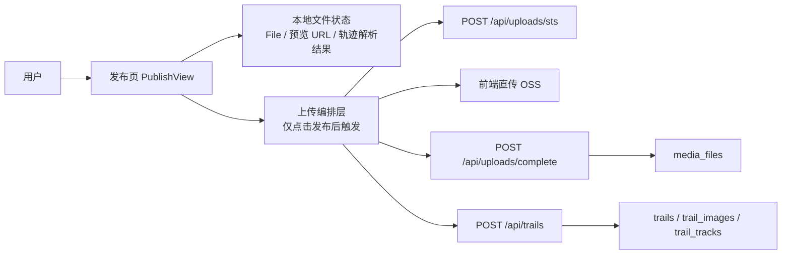
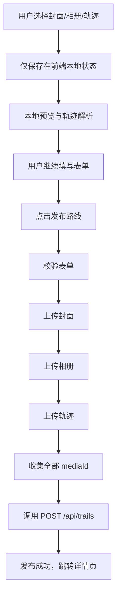
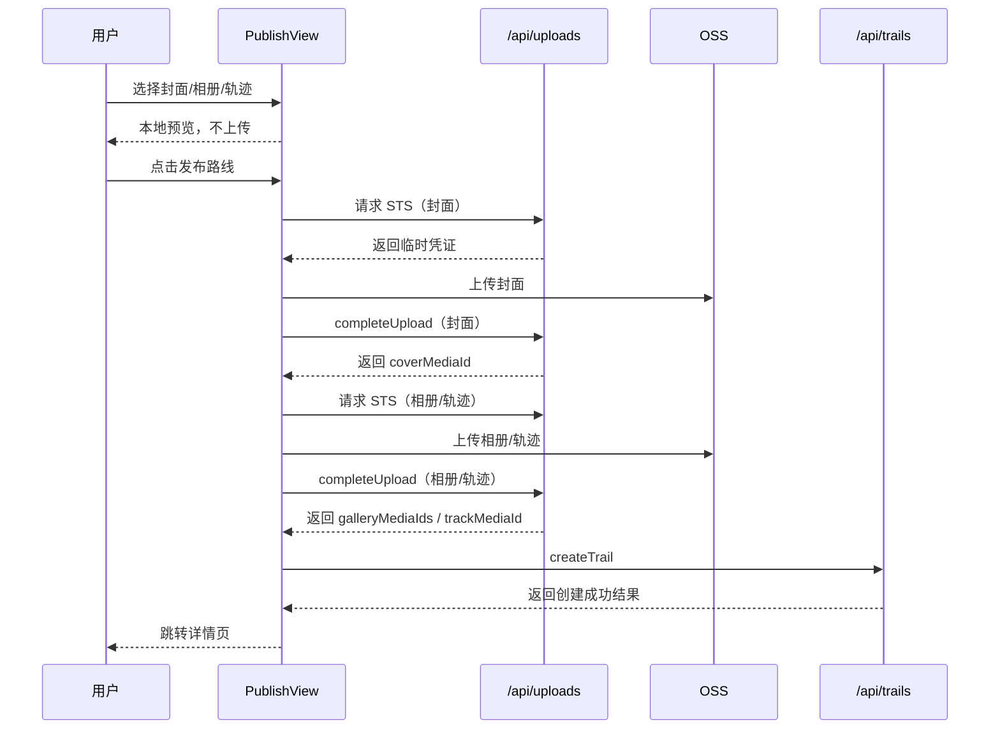

# 发布页“点击发布后再上传”可行性分析

本文档用于分析 TrailQuest 发布页是否适合从“选择文件即上传 OSS”切换为“点击发布后再统一上传 OSS”，并给出推荐方案、流程设计、影响范围与验收口径。

## 1. 结论先说

你的担心是合理的，而且不是单纯的主观体验问题，而是当前系统行为与用户心理模型之间存在明显偏差。

当前实现确实会带来这些问题：

- 用户还没点击“发布路线”，资源就已经上传到 OSS
- 会产生未最终发布的 OSS 对象和 `media_files` 记录
- 用户只是想先试几张图或换一条轨迹，也会触发真实上传
- 多图或轨迹文件较大时，前端会在填写过程中频繁进入上传状态，体验被打断

最终判断：

- 这个优化方向是可行的
- 也适合在当前阶段推进
- 推荐采用“点击发布后，前端统一直传 OSS，再提交 `createTrail`”的方案

## 2. 当前真实链路

基于当前仓库实现，发布页的真实上传链路如下：

1. 用户在发布页选择封面图、相册图、轨迹文件
2. 前端立即调用 `/api/uploads/sts`
3. 前端拿到 STS 临时凭证后直传 OSS
4. 上传完成后立即调用 `/api/uploads/complete`
5. 后端将文件记录写入 `media_files`
6. 用户点击“发布路线”时，只提交已经拿到的：
   - `coverMediaId`
   - `galleryMediaIds`
   - `trackMediaId`
7. 后端再调用 `POST /api/trails` 完成路线创建

当前实现可参考：

- `apps/web/src/views/PublishView.vue`
- `apps/web/src/composables/useOssImageUploader.ts`
- `apps/web/src/composables/useOssTrackUploader.ts`
- `apps/api/src/main/java/com/sheng/hikingbackend/controller/UploadController.java`

## 3. 为什么当前方案会存在

现有“选文件即上传”的设计不是错的，它有一些很现实的优点：

- 资源 `mediaId` 能提前拿到，点击发布时后端提交逻辑简单
- 单文件上传失败能尽早暴露，而不是等到最后一步才发现
- 前端上传、OSS 直传、文件记录落库的职责边界清晰
- 图片预览和轨迹文件后续处理逻辑更直观

如果系统目标是“尽快把上传链路打通”，它是一个合理的第一版方案。

## 4. 为什么现在值得改

你提出的新方案之所以成立，是因为当前产品已经进入体验打磨阶段，目标不再只是“能上传”，而是“用户在发布路线时的感受是否顺畅”。

当前方案的主要问题：

### 4.1 用户认知不一致

对用户来说：

- 选择文件只是“准备发布”
- 点击发布才是“真正提交”

但当前系统实际上是：

- 一选文件就开始真实上传
- 甚至已经产生永久资源记录

这会让系统行为和用户预期不一致。

### 4.2 会沉淀无效资源

当前会产生两类废弃资源：

- OSS 中已上传但最终未引用的对象
- `media_files` 中已落库但最终未被路线引用的记录

这些资源会随着发布页使用量增加而不断累积。

### 4.3 填写体验被打断

当前发布页在填写过程中会被这些动作打断：

- 图片逐张上传
- 轨迹文件直传
- 上传中状态锁定

对于用户来说，容易出现一种感觉：

- “我还没发布，为什么已经卡在上传了”

## 5. 可行性判断

结论：可行，而且改动路径很清晰。

原因：

- 当前后端上传接口已经稳定可用
- 当前 OSS STS 架构不需要推倒重来
- 发布接口 `POST /api/trails` 也不需要修改
- 这次重构的核心只是“改变上传时机”，而不是“改掉上传架构”

也就是说，这次改造主要集中在前端：

- 发布页状态管理
- 上传 composable 的调用方式
- 发布按钮流程编排

后端只需要继续复用现有能力。

## 6. 方案对比

### 方案 A：保持现状，选文件即上传

优点：

- 实现最简单
- 上传失败尽早暴露
- 发布提交时逻辑最轻

缺点：

- 产生废弃资源
- 打断用户填写流程
- 用户认知上不自然

结论：

- 不推荐继续扩展

### 方案 B：点击发布后，前端统一直传 OSS，再提交 `createTrail`

优点：

- 兼容现有 STS 直传架构
- 改动成本最低
- 用户体验更符合“最终提交才上传”的认知
- 选择文件阶段不会产生真实 OSS 对象和 `media_files`

缺点：

- 点击发布后的等待时间会变长
- 如果中途某个文件失败，需要更清晰的错误提示和重试逻辑
- 仍可能出现“部分已上传但发布失败”的残留资源

结论：

- 推荐

### 方案 C：点击发布后，先把文件发给后端，再由后端转传 OSS

优点：

- 前端更简单
- 上传调度集中在后端

缺点：

- 后端带宽、超时、资源占用压力明显更大
- 文件流接收、转存、异常补偿复杂度高
- 与当前已跑通的前端 STS 直传架构不一致

结论：

- 不推荐

## 7. 推荐方案

最终推荐方案：

- **方案 B：点击发布后，前端统一直传 OSS，再提交 `createTrail`**

原因：

- 能改善用户体验
- 能减少未发布垃圾资源
- 不需要重做上传架构
- 与当前系统兼容性最好

## 8. 新流程设计

### 8.1 文件选择阶段

用户选择封面、相册、轨迹时：

- 前端只保存本地 `File`
- 生成本地预览 URL
- 轨迹继续在本地解析，生成地图和 Three.js 预览数据
- 不调用 `/api/uploads/sts`
- 不上传 OSS
- 不调用 `/api/uploads/complete`

### 8.2 点击发布阶段

用户点击“发布路线”后：

1. 校验表单
2. 上传封面
3. 上传相册
4. 上传轨迹
5. 每个资源上传成功后调用 `/api/uploads/complete`
6. 收集全部 `mediaId`
7. 调用 `POST /api/trails`
8. 发布成功后跳转路线详情页

## 9. 架构图

说明：

- 当前架构中最重要的变化不是接口，而是 `上传编排层` 从“选文件阶段”移动到了“点击发布阶段”

## 10. 主流程图

## 11. 时序图

## 12. 前端影响分析

这次改造主要影响前端。

### 12.1 `useOssImageUploader`

需要从：

- 自动上传型

改成：

- 显式触发上传型

也就是说：

- `addFiles()` 不再负责真实上传
- 只负责加入本地待上传队列
- 新增类似 `uploadAll()` 或 `uploadItems()` 的显式上传入口

### 12.2 `useOssTrackUploader`

同样需要从：

- `setFile()` 即开始上传

改成：

- `setFile()` 只记录本地文件
- 真正上传由发布阶段显式调用

### 12.3 发布页状态管理

发布页需要维护两类状态：

- 本地资源状态
  - `File`
  - `localUrl`
  - 本地轨迹解析结果
- 发布阶段状态
  - 当前上传到哪一步
  - 上传进度
  - 已成功返回的 `mediaId`
  - 错误信息

### 12.4 本地预览必须保留

即使延迟上传，也必须保留这些体验：

- 封面预览
- 相册预览
- 轨迹预解析
- 地图预览
- Three.js 轨迹预览

这意味着：

- 预览能力必须基于本地文件，而不是基于远端 URL

### 12.5 发布按钮状态文案

建议在发布阶段明确区分状态：

- `上传封面中...`
- `上传相册中...`
- `上传轨迹中...`
- `创建路线中...`

这样用户不会误以为“页面卡住了”。

## 13. 后端影响分析

本次原则上不需要改后端接口设计，继续复用：

- `POST /api/uploads/sts`
- `POST /api/uploads/complete`
- `POST /api/trails`

原因：

- 后端当前问题不在于“不能延迟上传”
- 而在于前端现在把上传动作提前触发了

因此这次更像是：

- **前端流程重构**
- 而不是后端架构重构

## 14. 风险与后续治理建议

即使切换到延迟上传，仍然会有残留风险：

- 用户点击发布后，封面已上传成功
- 但相册或轨迹上传失败
- 或 `createTrail` 最终失败

这时仍然可能残留：

- OSS 对象
- `media_files` 记录

所以建议后续增加资源治理机制：

- 定时清理未关联业务的 `media_files`
- 或引入资源生命周期状态管理
- 或增加“临时资源”标记与过期回收机制

但这些内容不作为本次改造的前置条件。

## 15. 风险、边界与默认决策

这次方案默认接受以下边界：

- 页面刷新后，本地已选文件丢失：接受
- 点击发布后上传失败：不创建路线，保留表单内容，允许用户重试
- 不做断点续传
- 不做草稿系统
- 不做后端代传
- 不做页面关闭恢复
- 第一版相册可以小并发上传，其它串行

## 16. 验收口径

至少应满足以下验收标准：

- 选文件后，不应产生 `/api/uploads/sts` 请求
- 本地封面/相册预览仍正常
- 本地轨迹解析和预览仍正常
- 点击发布后才开始上传
- 所有资源成功后才创建路线
- 任意文件上传失败时，不创建路线
- 未点击发布就离开页面，不应新增 `media_files`
- 用户能清楚感知当前是在“上传资源”还是“创建路线”

## 17. 最终结论

把发布页从“选文件即上传”改成“点击发布后再统一上传”，是一个合理、可行、值得推进的优化方向。

它的本质不是重做上传架构，而是：

- 修正上传时机
- 让系统行为更符合用户认知
- 降低无效资源沉淀
- 提升发布流程的顺畅度

在当前 TrailQuest 的技术结构下，最适合采用的方案是：

- **延迟上传**
- **前端继续直传 OSS**
- **点击发布后统一执行上传与建路线流程**
