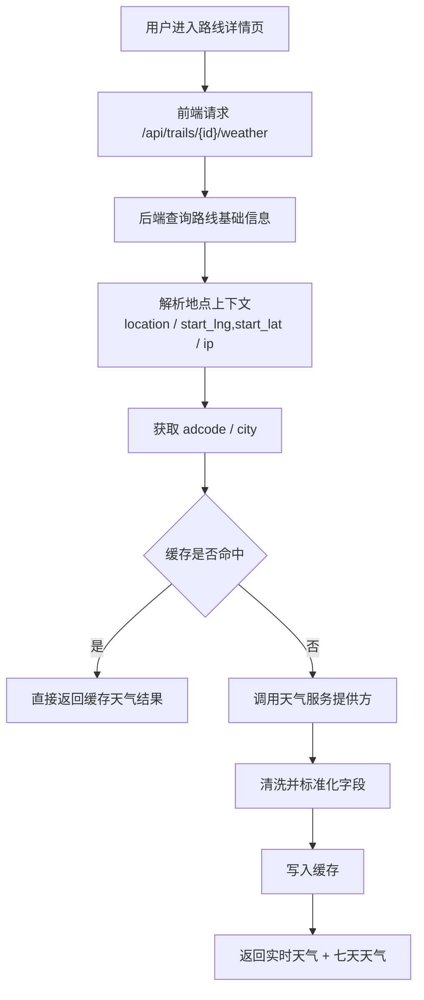
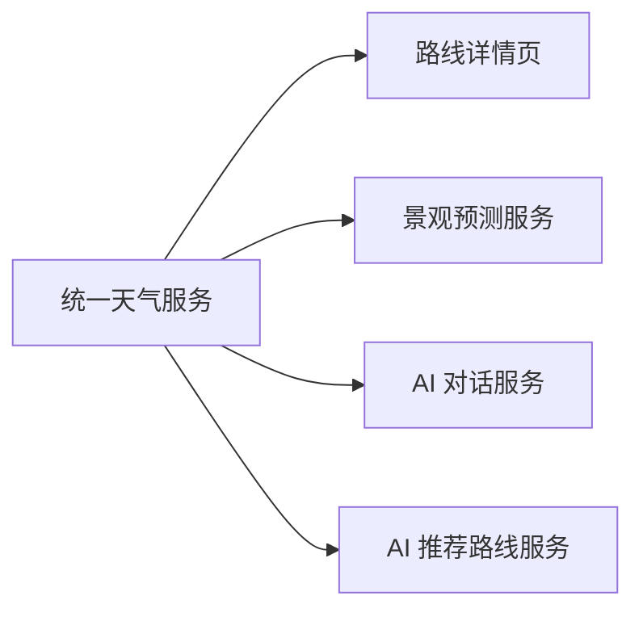

# TrailQuest 七天天气预报能力设计文档

本文档用于定义 TrailQuest 下一阶段“未来路线当地七天天气预报”能力的落地方案。目标不是只把第三方天气接口从前端搬到后端，而是建立一层可复用、可缓存、可被景观预测与 AI 调用的统一天气能力。

## 1. 背景与目标

### 1.1 当前现状

当前项目已经具备以下天气相关基础：

- 前端存在 `useTrailWeather.ts`
- 路线详情页已经展示实时天气与未来天气列表
- 发布页与详情页都已经会基于位置去查天气
- 高德天气接口当前由前端直接调用

当前存在的问题：

- 前端暴露第三方 key，不利于长期维护
- 发布页与详情页重复依赖天气查询逻辑
- 无法统一做缓存、限流、熔断与降级
- 景观预测和 AI 推荐路线无法稳定复用同一份天气数据
- 未来如果接更多天气数据源，前端改动成本高

### 1.2 本阶段目标

本阶段需要做到：

- 路线详情页稳定展示未来七天天气预报
- 天气能力迁移到后端统一出口
- 前端不再直连第三方天气接口
- 为景观预测与 AI 推荐路线提供统一天气查询能力
- 支持合理缓存，避免重复调用第三方接口

### 1.3 本阶段不做

为了控制复杂度，本阶段明确不做：

- 不做多天气源自动切换
- 不做复杂小时级预报全量建模
- 不做长期历史天气归档
- 不做用户级天气订阅与推送

## 2. 能力定位

七天天气预报能力在整体系统中的定位是“公共底层能力”。

它不仅服务于路线详情页，还将作为以下能力的输入：

- 景观预测
- AI 对话中的天气问答
- AI 推荐路线时的天气适配建议
- 后续的活动规划、出行建议、风险提示

换句话说，天气能力不是一个独立的小功能，而是后续智能能力的公共数据底座。

## 3. 推荐总体方案

### 3.1 方案概述

推荐新增统一天气接口：

- `GET /api/trails/{id}/weather`

该接口由后端完成：

1. 查询路线基础信息
2. 提取可用位置上下文
3. 优先读取路线位置文本，必要时使用路线起点经纬度兜底解析城市编码或行政区编码
4. 调用天气提供方
5. 统一清洗返回字段
6. 做缓存与降级
7. 返回给前端详情页

### 3.2 为什么优先使用“按 trailId 聚合”

虽然也可以设计为：

- `GET /api/weather?adcode=`

但当前阶段更推荐：

- `GET /api/trails/{id}/weather`

原因：

- 前端详情页只关心“这条路线的天气”，不想再自己拼位置参数
- 后端更容易统一封装“路线 -> 地点 -> 天气”的完整链路
- 景观预测未来也需要同样的路线上下文
- 前端依赖更简单，错误边界更清晰

后续如果其它模块有通用天气需求，再补一个公共查询接口即可。

## 4. 数据流设计

### 4.1 主流程



### 4.2 与其它能力的关系



## 5. 接口设计建议

### 5.1 推荐接口

- `GET /api/trails/{id}/weather`

### 5.2 返回结构建议

```json
{
  "current": {
    "city": "杭州",
    "adcode": "330100",
    "weather": "多云",
    "temperature": "22",
    "humidity": "45",
    "windDirection": "东南",
    "windPower": "3",
    "reportTime": "2026-03-28 16:00:00"
  },
  "forecast": [
    {
      "date": "2026-03-28",
      "week": "6",
      "dayWeather": "多云",
      "nightWeather": "阴",
      "dayTemp": 24,
      "nightTemp": 15
    }
  ],
  "locationContext": {
    "city": "杭州",
    "adcode": "330100",
    "resolvedFrom": "location_text"
  },
  "source": {
    "provider": "amap",
    "cached": true
  }
}
```

### 5.3 字段说明

建议至少保留以下字段：

- `current.city`
- `current.adcode`
- `current.weather`
- `current.temperature`
- `current.humidity`
- `current.windDirection`
- `current.windPower`
- `current.reportTime`
- `forecast[].date`
- `forecast[].week`
- `forecast[].dayWeather`
- `forecast[].nightWeather`
- `forecast[].dayTemp`
- `forecast[].nightTemp`

额外建议保留：

- `locationContext.resolvedFrom`
- `source.provider`
- `source.cached`

原因：

- 便于调试
- 便于后续景观预测判断数据质量
- 便于区分真实值与缓存值

## 6. 路线位置解析策略

当前路线还没有稳定的标准地理编码字段，因此建议采用分层解析策略。

### 6.1 优先级建议

1. 已落库的标准行政编码字段
2. 路线发布地点文本 `location`
3. 路线起点经纬度 `start_lng/start_lat`
4. 历史 IP 兜底

### 6.2 当前阶段推荐

当前最现实的方案是：

- 优先使用 `location`
- 文本解析不足时，使用 `start_lng/start_lat`
- 只有前两者都不可用时，才回退到 `ip`

原因：

- `location` 对当前多数路线已可用
- 路线起点经纬度来自轨迹文件真实数据，比 IP 更可信
- 既能兼顾当前数据现状，也能给后续景观预测与 AI 复用留下稳定入口

## 7. 缓存策略建议

### 7.1 为什么必须缓存

天气接口是高频读、低频变化能力，非常适合缓存。

如果不做缓存，会出现：

- 同一路线详情被频繁打开时重复请求第三方
- AI 对话与景观预测同时查询时重复打第三方
- 前端刷新页面时重复消耗配额

### 7.2 推荐缓存粒度

建议按：

- `weather:trail:{trailId}`
- 或 `weather:adcode:{adcode}`

优先推荐：

- `weather:adcode:{adcode}`

原因：

- 同城多条路线可以复用同一份天气数据
- 更符合天气数据本质
- 后续 AI 和景观预测也更容易共用

### 7.3 推荐缓存时长

建议：

- 实时天气：10 到 20 分钟
- 七天天气：30 到 60 分钟

如果简化为单一缓存对象，当前阶段建议：

- 总体 TTL 30 分钟

## 8. 后端模块建议

### 8.1 推荐新增模块

- `controller/TrailWeatherController.java`
- `service/TrailWeatherService.java`
- `service/impl/TrailWeatherServiceImpl.java`
- `service/weather/WeatherProvider.java`
- `service/weather/AmapWeatherProvider.java`
- `vo/weather/TrailWeatherVo.java`
- `vo/weather/TrailWeatherForecastDayVo.java`
- `vo/weather/TrailWeatherResponseVo.java`

### 8.2 服务分层建议

建议拆成三层：

1. `TrailWeatherService`
   - 对外提供“按路线查天气”的业务能力

2. `WeatherProvider`
   - 负责对接第三方天气源

3. `LocationResolver`
   - 负责把路线上下文转成 `adcode` 或城市编码

这样做的好处是：

- 更方便替换数据源
- 更方便单测
- 更方便被景观预测与 AI 层复用

## 9. 前端改造建议

### 9.1 当前改造目标

前端当前只需要做两件事：

1. 删除详情页与发布页对第三方天气的直接依赖
2. 统一改为请求后端天气接口

### 9.2 推荐新增内容

- `src/api/weather.ts`
- `src/types/weather.ts`
- 详情页 weather 数据请求改造

### 9.3 前端展示建议

详情页继续展示：

- 当前天气卡片
- 七天天气列表

不建议当前阶段额外扩展：

- 小时级折线图
- 降水概率图表
- 复杂天气动画面板

先把稳定数据链路做实，再做表现层优化。

## 10. 失败与降级策略

### 10.1 可能失败的环节

- 路线位置解析失败
- 第三方天气接口失败
- 第三方返回字段缺失
- 缓存不可用

### 10.2 建议降级策略

1. 如果天气查询失败：
   - 返回明确错误码
   - 前端显示“天气暂时不可用”

2. 如果当前天气成功但七天预报失败：
   - 允许部分返回
   - 不要整页都不可用

3. 如果位置解析失败：
   - 明确告知“路线位置解析失败”
   - 便于后续修正路线数据

## 11. 验收标准

完成后应满足：

- 路线详情页可稳定展示未来七天天气
- 前端不再直接调用第三方天气接口
- 同一路线频繁访问时后端能命中缓存
- 返回字段结构稳定，景观预测和 AI 层可直接复用
- 天气失败时页面仍可正常展示其他详情内容

## 12. 推荐开发顺序

建议按以下顺序推进：

1. 定义返回结构与 VO
2. 实现路线位置解析
3. 对接天气提供方
4. 加缓存层
5. 前端详情页改造
6. 再接景观预测与 AI 层调用

## 13. 一句话总结

七天天气预报不是一个单独的小功能，而是 TrailQuest 下一阶段景观预测与 AI 推荐路线能力的基础数据底座，应该优先以“后端统一能力”的形式建设，而不是继续维持前端直连方案。
